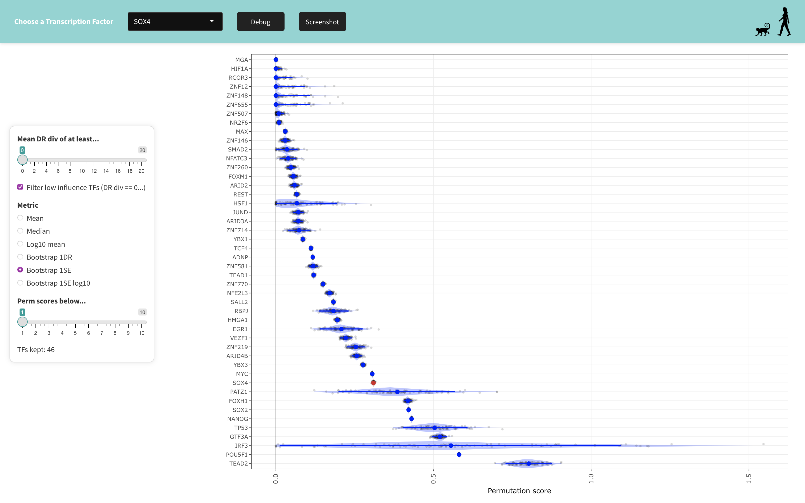

# perturbSeq_shiny

An interactive Shiny application to explore results from a perturbation-based single-cell transcriptomics experiment in primate iPSCs.

This app is part of an ongoing project. The required data is **not included in the repository** and the app is **not fully runnable** without internal datasets.

---

## 🌟 Features

- 🧬 TF-specific visualization of knockdown, enrichment, and conservation
- 🔎 Responsive TF selector with lazy-loaded analysis tabs
- 📊 Dynamic plots (ggplot2/plotly) and interactive tables (DT)
- 🧠 Built-in gating logic to hide unavailable results
- 💡 Contextual help via info buttons + bottom sheet
- ⚡ Precomputed data caches for fast startup

---

## 🗂️ Project Structure

```

perturbSeq_shiny/
├── app.R                  # Main entry point
├── data/                 # Precomputed RDS data files
│   └── TF_lists/, enrichment/, expression/, ...
├── R/
│   ├── ui/               # Modular UI definitions
│   ├── server/           # Tab-specific server modules
│   ├── helper/           # Utility functions (plotting, logic, caching)
│   ├── style/            # Styling and layout helpers
│   └── setup/            # Preprocessing scripts to create .rds files
├── www/                  # Static assets (images, CSS)
└── README.md             # This file

````

---

## 🚀 Getting Started

### 1. Clone the repository

```bash
git clone https://github.com/yourusername/perturbSeq_shiny.git
cd perturbSeq_shiny
````

### 2. Start a clean R session

```r
source("app.R")
```

### 3. Required R packages

Install all required packages (suggest using `renv` or manually):

```r
install.packages(c("shiny", "shinyBS", "shinythemes", "shinyFiles", "shinyjs", 
                   "yaml", "DT", "plotly", "ggplot2", "universalmotif", "here"))
```

---

## 🧠 Design Notes

* Modular tab-based architecture with lazy loading
* `smart_tab_loader()` ensures modules only initialize when tabs are first opened
* `selected_tf` is shared across modules, and changes only affect active tabs
* Outputs are gated by TF availability (e.g. using `TF_filter_information.rds`)
* Caching (`bindCache()`) is used for expensive operations

---

## 📁 Setup Scripts

If the raw data changes, rerun the scripts in `R/setup/` to regenerate `.rds` files used in the app.

* `TF_filter_information.R` — defines gating logic
* `summarize_permutations.R` — precomputes results for conservation analysis

---

## 🖼️ Screenshots

### Differential Expression (Human vs. Cynomolgus)


### Conservation Analysis Across Transcription Factors


### Knockdown Efficiency per gRNA


### Cell Numbers per Species and gRNA


---

## 📄 Technical Overview

A full technical writeup is available here:
[📘 perturbSeq_shiny – Technical Overview](./docs/perturbSeq_shiny_technical_overview.html)

Or preview the source:
[perturbSeq_shiny_technical_overview.html](/mnt/data/4504670d-cfd1-4c67-ba51-29d8cd346ea0.png)

## 👥 Authorship & Contributions

This Shiny application was designed and implemented by **Pascal Stümpfl**, including:

- Application architecture and modular Shiny design  
- Interactive visualizations and UI/UX logic  
- Data integration, caching strategies, and gating logic  

### Data Analysis  
The underlying data analysis was performed by:

- **Fiona C. Edenhofer**  
- **Anita Térmeg**  
- **Beate Vieth**  
- **Ines Hellmann**  
- **Pascal Stümpfl**

### Data Generation  
- Single-cell perturbation data generation was carried out by **Fiona C. Edenhofer**.

### Research Environment  
This project was developed within the research environment of the **Hellmann–Enard Lab**, led by  
**Ines Hellmann** and **Wolfgang Enard**.

🔗 Lab website: https://www.humangenetik.bio.lmu.de/personen/hellmann-group/index.html

